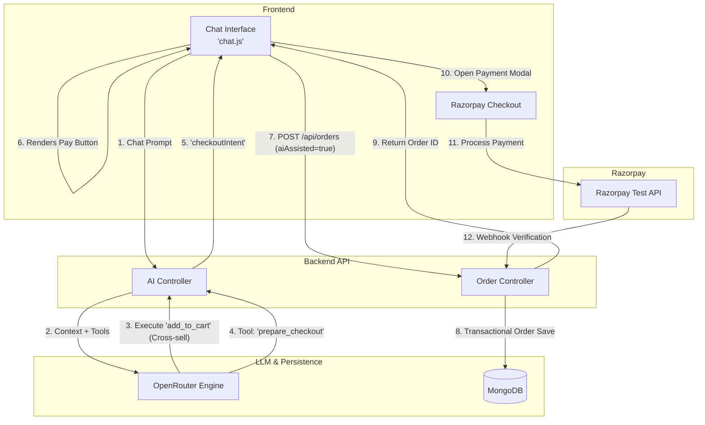

# 🛍️ NovaMart — E-Commerce Website

Welcome to NovaMart! This is a complete, fully functional e-commerce store designed to provide a seamless shopping experience for customers and a powerful management system for store owners. 

## 🌟 What is NovaMart?

NovaMart is an online shopping platform where users can browse products, manage their cart, securely check out, and track orders. 

What makes NovaMart special is our **AI Personal Shopper**. Integrated directly into the storefront, you can chat with an intelligent assistant to quickly find the perfect products and have them added to your cart for you!

## ✨ Key Features

### For Customers (Shoppers)
* **Easy Browsing & Searching:** Find exactly what you want using search, category filters, and price ranges.
* **Smart Cart & Wishlist:** Add items you love to your wishlist, or put them in your cart to buy. The system ensures you only buy products that are actually in stock!
* **AI Personal Shopper:** Click the chat bubble on any page to talk to our AI assistant. It can answer questions about our products and add them to your cart instantly.
* **Secure Checkout:** Pay using Cash on Delivery (COD) or securely via standard online payment gateways.
* **Reviews & Ratings:** Leave reviews for products you've bought, and see what others think.

### For Store Admin (Owners)
* **Admin Dashboard:** A full private section to monitor the store's health—users, products, and revenue.
* **Inventory Management:** Add new products, update prices, or hide items that are out of stock.
* **Order Management:** See every order placed, update their status, and handle cancellations.
* **Review Moderation:** Review and approve customer feedback before it appears on the public store.

## 🧠 Architecture Overview (Razorpay AI Buildathon)

The integration flow designed for **Track 01 — AI Growth & Agentic Commerce**:

---

## 🚀 Trying It Out (For Developers)

NovaMart is built using a straightforward technology stack to keep things fast and simple:
* **Frontend:** Standard HTML, CSS, and JavaScript. (No complex frameworks)
* **Backend:** Node.js with Express.
* **Database:** MongoDB to securely store data.
* **AI Engine:** Powered by OpenRouter for the Personal Shopper assistant.

### How to start the project locally:

1. **Setup the Database and Backend:**
   * Open your terminal and go to the `backend` folder: `cd backend`
   * Install the dependencies by running: `npm install`
   * Check the `.env.example` file, create a new file named `.env`, and fill in your details (like database keys and API tokens).
   * Start the server with: `npm start`

2. **Setup up the Storefront website:**
   * From the root (main) folder of the project, run: `node dev-server.js`
   * The store will now be accessible from your web browser at: `http://127.0.0.1:5500`

### Running Automated Tests
NovaMart comes with a comprehensive test suite to ensure everything runs smoothly.
If you are modifying the code, you can run tests locally (inside the `backend/scripts` and `backend/utils` folders) like this:
* `node e2eReviews.js`
* `node e2eSearchRelated.js`
* `node e2eCustomerOrder.js`
* `node e2eSecurity.js`

⚠️ **Important Note for Contributors:** Please read `agent_memory.md` before making any structural changes to the project. It acts as our single source of truth for the codebase.